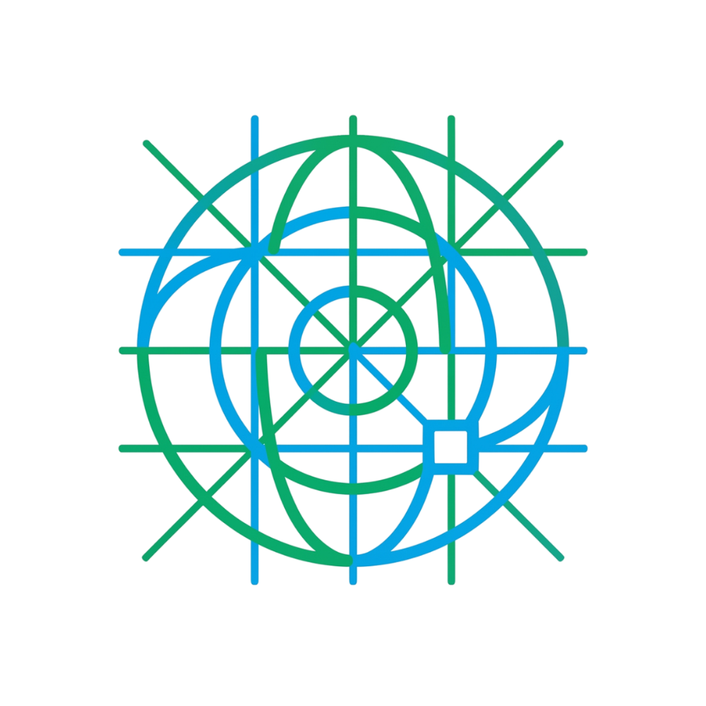

<div align="center">
  
  <h1>GEOSTRA</h1>
  <p><b>Geospasial Sistem Tata Ruang & Area</b></p>
  <p><i>Sistem Kecerdasan Spasial & Telemetri Batch Berbasis AI</i></p>
</div>

---

## 🌍 Tentang Proyek
**GEOSTRA** adalah platform web analitik geospasial kelas industri yang dibangun di atas **Streamlit**. Aplikasi ini memadukan kekuatan *Computer Vision* (YOLOv8-OBB) dan *Geographic Information Systems* (GIS) untuk mendeteksi, memetakan, dan menganalisis infrastruktur bangunan secara presisi dan otomatis dari citra satelit (GeoTIFF). 

Aplikasi ini dirancang sebagai alat bantu eksekutif bagi analis tata ruang, perencana kota, maupun peneliti untuk memproses berhektar-hektar citra satelit dengan waktu ekstraksi yang minimal, sekaligus menghasilkan wawasan komparatif spasial yang mendalam.

---

## ✨ Fitur Utama

1. **🤖 Deteksi Bangunan Presisi Tinggi (AI)**
   - Menggunakan model **YOLOv8x-OBB** (Oriented Bounding Boxes) yang dilatih khusus untuk mendeteksi footprint bangunan pada berbagai resolusi citra satelit.
   - Deteksi *Oriented Bounding Box* memastikan sudut bangunan tertangkap akurat mengikuti pola geografis nyata.

2. **📊 Executive Dashboard & Makro Analitik**
   - Panel metrik telemetri yang memonitor *Confidence Mean*, Total Luas Atap, Estimasi Permukiman, dan Kepadatan Bangunan.
   - Visualisasi interaktif menggunakan **Plotly Studio** (Grafik Radar Distribusi Spasial & Histogram Kepadatan Area).

3. **🗺️ Peta Interaktif Global (Interactive Mapping)**
   - Integrasi **Folium & Streamlit-Folium** dengan fitur layer gabungan dari banyak sampel wilayah.
   - Termasuk minimap, skala, pengukuran (measure control), dan toggle layer *GeoJSON* untuk masing-masing area.

4. **💾 Pusat Unduhan & Ekspor Laporan Otomatis**
   - **ReportLab PDF Generator:** Secara otomatis merakit laporan eksekutif lengkap (lengkap dengan tabel, peta sebaran, dan matriks statistik) dalam format A4.
   - **Vektor GIS (GeoJSON):** Data hasil deteksi dapat langsung diunduh dan dibuka di _software_ GIS standar industri seperti **QGIS** atau **ArcGIS**.
   - **Data Tabular (CSV):** Rekaman metrik area untuk analisis lanjutan di Excel/Python.

5. **☁️ Integrasi Penyimpanan Lokal & Cloud**
   - Sistem *checkpoint* mandiri (batch results) yang bisa disinkronkan ke Google Drive atau sistem penyimpanan lokal (dapat dikonfigurasi melalui *relative path* `./SIG_Deteksi_Bangunan`).

---

## 🛠️ Teknologi & Modul Utama
- **Frontend & UI:** `Streamlit`, `Plotly`, `Folium`
- **Geospasial & Citra:** `GeoPandas`, `Rasterio`, `Shapely`
- **Machine Learning / AI:** `Ultralytics (YOLOv8)`, `PyTorch`, `OpenCV` (Headless)
- **Reporting & Export:** `ReportLab`, `Pandas`

---

## 🚀 Cara Instalasi & Menjalankan (Local)

1. **Clone Repositori:**
   ```bash
   git clone https://github.com/julianfiru/geostra.git
   cd geostra
   ```

2. **Install Dependensi:**
   Disarankan menggunakan virtual environment (venv atau conda).
   ```bash
   pip install -r requirements.txt
   ```

3. **Jalankan Aplikasi:**
   ```bash
   streamlit run app.py
   ```
   Aplikasi akan terbuka secara otomatis di `http://localhost:8501`.

---

## 📡 Catatan untuk Streamlit Cloud Deployment
Jika Anda mendeploy aplikasi ini ke **Streamlit Community Cloud**, sistem telah disesuaikan agar berjalan lancar tanpa bentrok dengan pustaka sistem (*OS-level libraries*). Pastikan Anda menggunakan **Python 3.10 / 3.11** pada _Advanced Settings_ saat mendeploy untuk memastikan kompabilitas `geopandas` dan `rasterio` dapat menggunakan *pre-built wheels*.

---

*Dikembangkan untuk efisiensi pemetaan spasial tingkat lanjut.*
